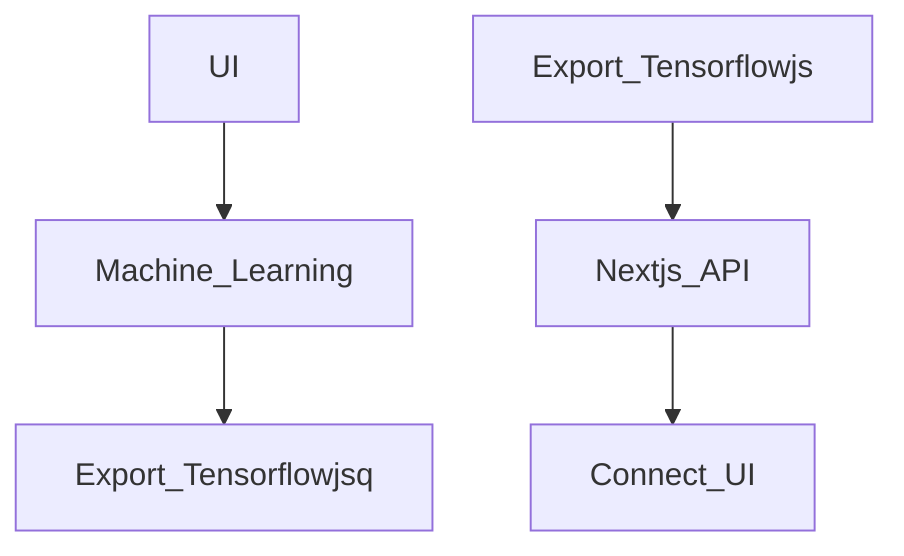

# TOBACCO SATELLITE FARMING SYSTEM :sunglasses:

## Techstack

| Heading | Heading |
| -- | -- |
| Application | Nextjs |
| Model Training | Pure Python with Tensorflow |
| Satellite Data |  |

## Requirements

* Farmer can draw a polygon of his field.
* We pull data from the past and use it to analyse
* Pull current imagery as well
* Advice the farmer on what to do
* Use the current season data and weather for that advice
* Make predictions

## Procedure

